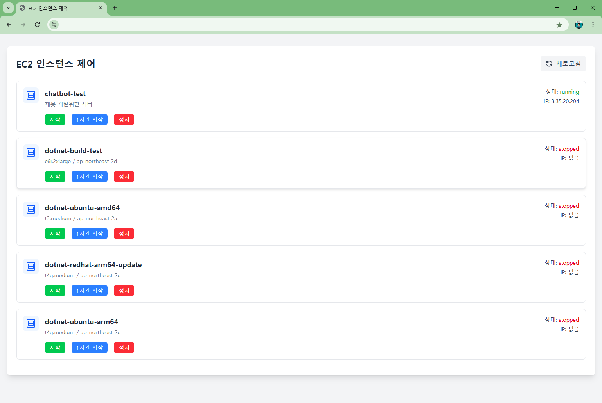

# EC2 인스턴스 관리 도구

이 프로젝트는 AWS EC2 인스턴스를 제어하고 관리하는 간단한 웹 애플리케이션입니다. 사용자는 인스턴스를 시작, 중지, 특정 시간 동안 실행 후 자동 종료 등을 쉽게 관리할 수 있습니다.

## 기능

- **인스턴스 목록 조회**: 현재 등록된 EC2 인스턴스의 상태를 확인할 수 있습니다.
- **인스턴스 제어**:
  - **시작**: EC2 인스턴스를 시작하고, DNS를 자동으로 업데이트 합니다.
  - **1시간 시작**: 인스턴스를 시작하거나 이미 실행 중인 인스턴스에 대해 1시간 후 자동 종료 태그를 추가합니다.
  - **정지**: 인스턴스를 중지합니다.
- **상태 확인**: 현재 선택된 인스턴스의 상태와 공인 IP를 조회합니다.
- **자동 종료**: 설정된 시간에 인스턴스를 자동으로 중지합니다.

### 사용 방법

- 브라우저에서 `index.html`을 열거나, 웹 서버를 통해 접근합니다.
- 인스턴스를 선택하고, 원하는 액션 버튼을 클릭합니다.

## 코드 구조

- `index.html`: 사용자 인터페이스와 클라이언트 측 JavaScript 포함.
- `index.mjs`: AWS EC2 및 Route 53과 상호작용하기 위한 서버리스 함수 (Lambda).
- `index.mjs` (두 번째): 인스턴스 실행 시간 모니터링 및 자동 종료 기능을 위한 Lambda 함수.
